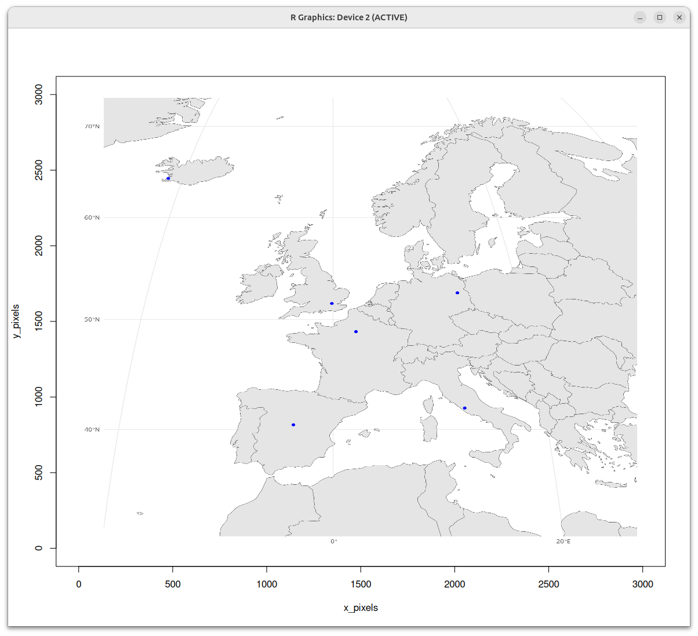
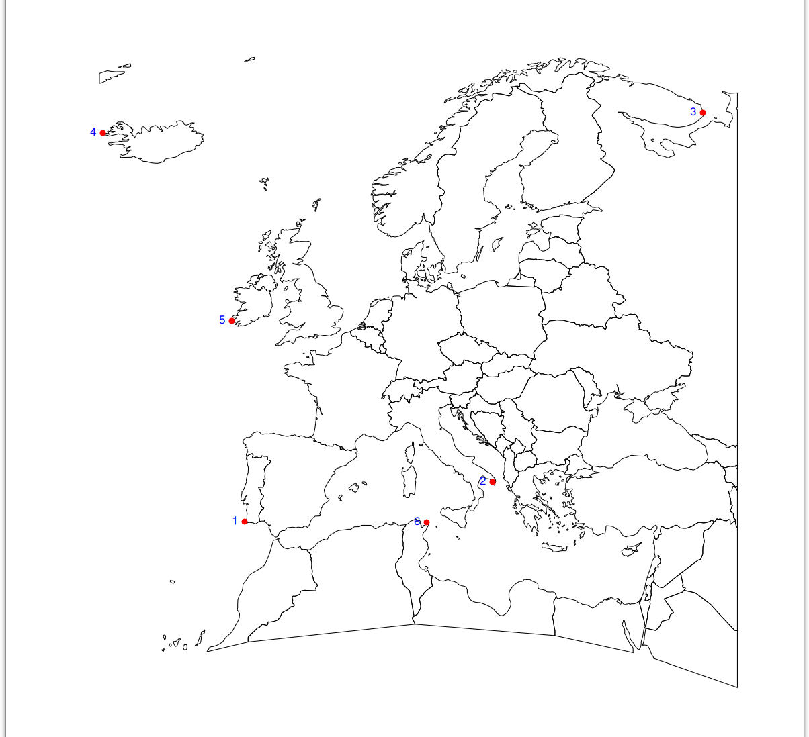
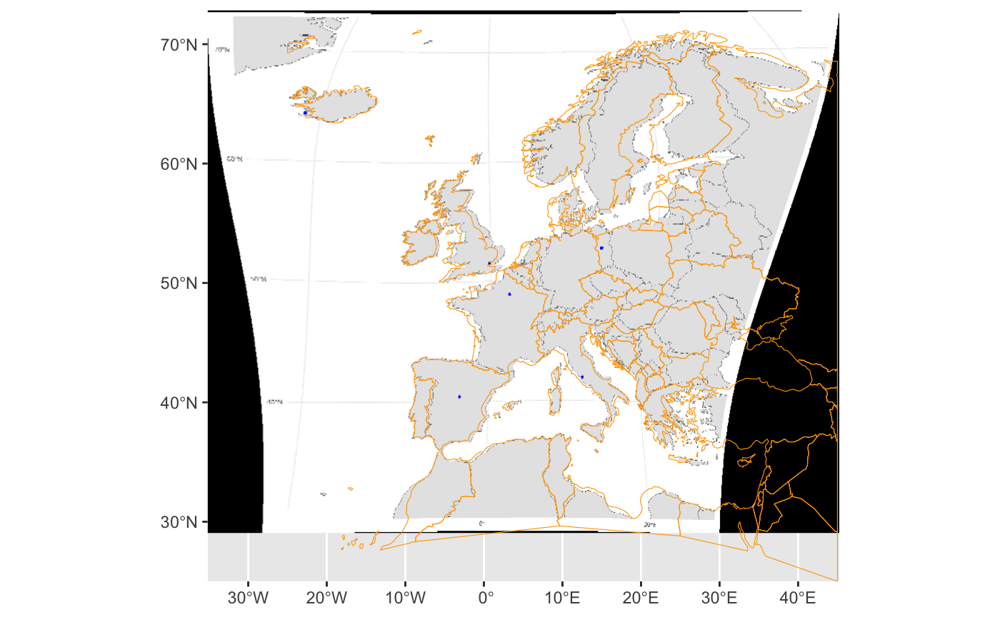
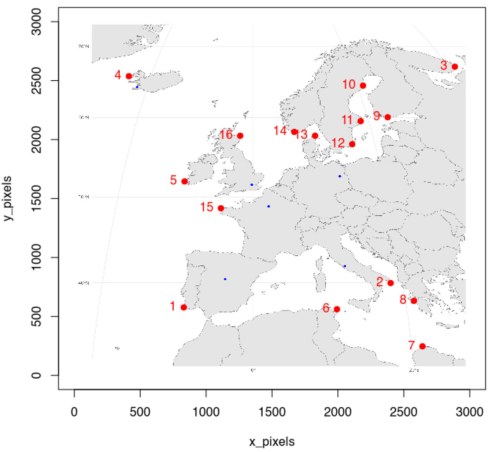

```{r, include = FALSE}
knitr::opts_chunk$set(
  collapse = TRUE,
  comment = "#>"
)
```
# Georeference an image

Georeferencing is the process of assigning real-world coordinates to an image,
allowing it to be accurately placed on a map. This is often done using Ground
Control Points (GCPs), which are known locations on the ground with precise coordinates.
In this vignette, we will demonstrate how to georeference an image using GCPs
in the `crswizard` package.

The process of assigning GCPs to an image is interactive, allowing you to
select points on the image and assign them geographic coordinates. Unfortunately,
this is not compatible with Rmarkdown or the image pane within RStudio. `crswizard`
opens separate windows for GCP assignment and image display, and the code has to
be run from a script or the console.

To get started, we need to load the `crswizard` package:

```{r setup}
library(crswizard)
```

Next we need a jpg image that we scanned or downloaded. We will use a map of Europe
that is included with the package. The map has a number of points (the capitals of 
UK, France, Spain, Germany, Italy, and Iceland). 
Our task is to georeference this image and then extract the coordinates
of those capitals.

```{r image_path}
img_path <- system.file("extdata/europe_map.jpeg", package = "crswizard")
```

We can now select a number of GCPs with `choose_gcp()`. This function
allows you to click on the image and assign coordinates to the points you select.
Choose locations that are easy to find again on a map, such as features in coastlines (e.g. bays),
or corners of country boundaries.
```{r choose_gcp, eval = FALSE}
gcp_europe <- choose_gcp(img_path)
```

This will open a window showing the image:



You can click on the image to select points by left-clicking with your mouse. The points will be numbered in the order
in which they were chosen; you can stop by pressing the ESC key, or with a right-click.



```{r save_gcp1, echo = FALSE, eval= FALSE}
# Run me to save the object if you are recreating the vignette
saveRDS(gcp_europe,"./vignettes/img/europe_gcp1.RDS")
```

```{r load_gcp1, echo = FALSE, results = "hide"}
#gcp_europe <- system.file("extdata/gcp_europe.rds", package = "crswizard")
gcp_europe <- readRDS("./img/europe_gcp1.rds")
```

The coordinates of those points will be
saved in the `gcp_europe` dataframe, which contains the following columns:
```{r gcp_europe}
gcp_europe
```

Next we need to get the coordinates (longitude and latitude) of these points. We can use the `find_gcp_coords()` function
to assign geographic coordinates to the GCPs. This function requires a reference map in the form of an `sf` object.
We will use the `rnaturalearth` package to get a map of Europe, and then crop it to the extent of the image.
```{r get_coords}
library(sf)
library(rnaturalearth)
# Load the world map
world <- rnaturalearth::ne_countries(scale = "medium", returnclass = "sf")
# Transform it to a suitable projection
world <- st_transform(world, crs = 4326) # WGS 84
# Crop it to the extent of the image to Europe
europe <- st_crop(world, c(xmin = -25, ymin=25, xmax = 45, ymax = 70))
```

Let's quickly plot it to check that we have the correct extent:
```{r plot_europe}
library(ggplot2)
ggplot() +
  geom_sf(data = europe, fill = "lightblue", color = "black") +
  coord_sf(expand = FALSE) +
  ggtitle("Map of Europe")
```
Now we can use the `find_gcp_coords()` function to assign geographic coordinates to the GCPs.


```{r find_gcp_coords, eval = FALSE}
gcp_europe_coords <- find_gcp_coords(gcp_europe, europe)
```
This will open a new window with the map of Europe, and you can click on the points to assign coordinates to the GCPs.
```{r save_gcp2, echo = FALSE, eval= FALSE}
# Run me to save the object if you are recreating the vignette
saveRDS(gcp_europe_coords,"./vignettes/img/europe_gcp_georef.RDS")
```

```{r load_gcp2, echo = FALSE, results = "hide"}
#gcp_europe_coords <- system.file("extdata/gcp_europe_coords.rds", package = "crswizard")
gcp_europe_coords <- readRDS("./img/europe_gcp_georef.RDS")
```

Now the `gcp_europe_coords` dataframe contains the geographic coordinates of the GCPs:
```{r gcp_europe_coords}
gcp_europe_coords
```

Finally, we can use the `georeference_image()` function to georeference the image using the GCPs. 
This function will create a new TIFF file with the georeferenced image.
```{r georeference_image}
georeferenced_image <- georeference_img(img_path, gcp_europe_coords)
```
The `georeference_img()` function will create a new TIFF file with the georeferenced image. The output file will have the same name as the input image, but with the suffix `_warp.tif` added to it.
@FIXME we need to put this in a temporary directory

The georeferenced image can be loaded into R using the `terra` package as a SpatRaster:
```{r load_georeferenced_image}
map_warp <- terra::rast(georeferenced_image)
```
We can now plot the georeferenced image to check the overlap between the input image and the georeferenced image. 
This can inform us if more points (GCPs) need to be added and previous steps repeated (`choose_gcp()`).
```{r plot_warped_image}

library(ggplot2)
library(tidyterra)
ggplot() +
  geom_spatraster_rgb(data = map_warp) +
  geom_sf(
    data = europe,
    color = "orange",
    fill = "transparent"
  ) +
  coord_sf(expand = FALSE)
```



To add more points to improve the fit, we use: 
```{r choose_gcp_version2, eval = FALSE}
gcp_europe <- choose_gcp(img_path, gcp = gcp_europe) 

```

```{r save_gcp2_update, echo = FALSE, eval= FALSE}
# Run me to save the object if you are recreating the vignette
saveRDS(gcp_europe,"./img/europe_gcp2.RDS")

```

```{r load_gcp2_update, echo = FALSE, results = "hide"}
# Reload if needed
gcp_europe <- readRDS("./img/europe_gcp2.rds")
```

Additional points were added to the `gcp_europe` dataframe:
```{r gcp_europe2}
gcp_europe
```

Check the map with the original points 


Now we can repeat the process of assigning coordinates to the GCPs using `find_gcp_coords()` and `georeference_img()`:
```{r find_gcp_coords_version2, eval = FALSE}
gcp_europe_coords_v2 <- find_gcp_coords(gcp_europe, europe)

gcp_europe_coords_v2
```

Run me to save the object if you are recreating the vignette
```{r save_gcp2_v2, echo = FALSE, eval= FALSE}
saveRDS(gcp_europe_coords_v2,"./img/europe_gcp_georef_v2.RDS")
```

```{r load_gcp2_v2, echo = FALSE, results = "hide"}
gcp_europe_coords_v2 <- readRDS("./img/europe_gcp_georef_v2.RDS")
```

Repeat georeferencing of the image using the GCPs. 
```{r georeference_image_v2}
georeferenced_image_v2 <- georeference_img(img_path, gcp_europe_coords_v2)

map_warp_v2 <- terra::rast(georeferenced_image_v2)

# check the new image
ggplot() +
  geom_spatraster_rgb(data = map_warp_v2) +
  geom_sf(
    data = europe,
    color = "orange",
    fill = "transparent"
  ) +
  coord_sf(expand = FALSE)
```


We can see that the additional points improved the georeferencing of the image, 
as the map now aligns better with the geographic coordinates of the GCPs.

We now use locator to get the coordinates of the blue dots
```{r get_coords_2, eval = FALSE}
# get the coordinates of the blues points
blue_coords_df <- extract_coords(map_warp_v2)
```

```{r save_blue_coords, echo = FALSE, eval= FALSE}
saveRDS(blue_coords_df,"./img/blue_coords.RDS")
```

```{r load_blue_coords, echo = FALSE, results = "hide"}
blue_coords_df <- readRDS("./img/blue_coords.RDS")
```

So we now have the coordinates of the blue points:
```{r show_blue_coords}
blue_coords_df
```

There are only 5 entries - we forgot one of the dots, let's re run the function:
```{r get_coords_3, eval = FALSE}
blue_coords_df <- extract_coords(map_warp_v2, blue_coords_df)
```

```{r save_blue_coords_2, echo = FALSE, eval= FALSE}
saveRDS(blue_coords_df,"./img/blue_coords_2.RDS")
```

```{r load_blue_coords_2, echo = FALSE, results = "hide"}
blue_coords_df <- readRDS("./img/blue_coords_2.RDS")
```

So we now we can see check that all the blue dots have been recorded:
```{r show_blue_coords}
blue_coords_df
```

Starting from a non georeferenced image, we were then able to extract the 
coordinates of our locations of interest. 

